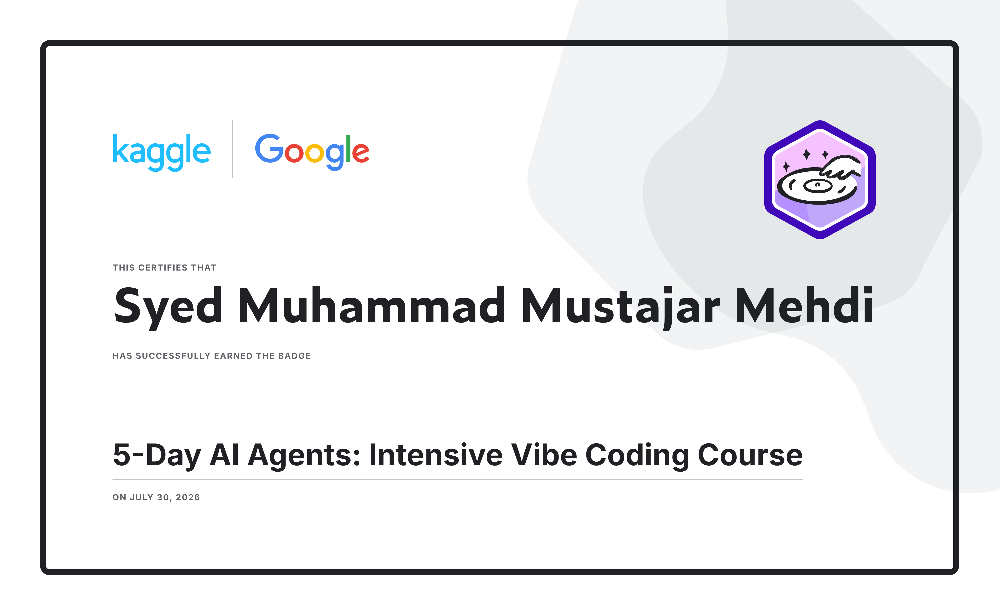
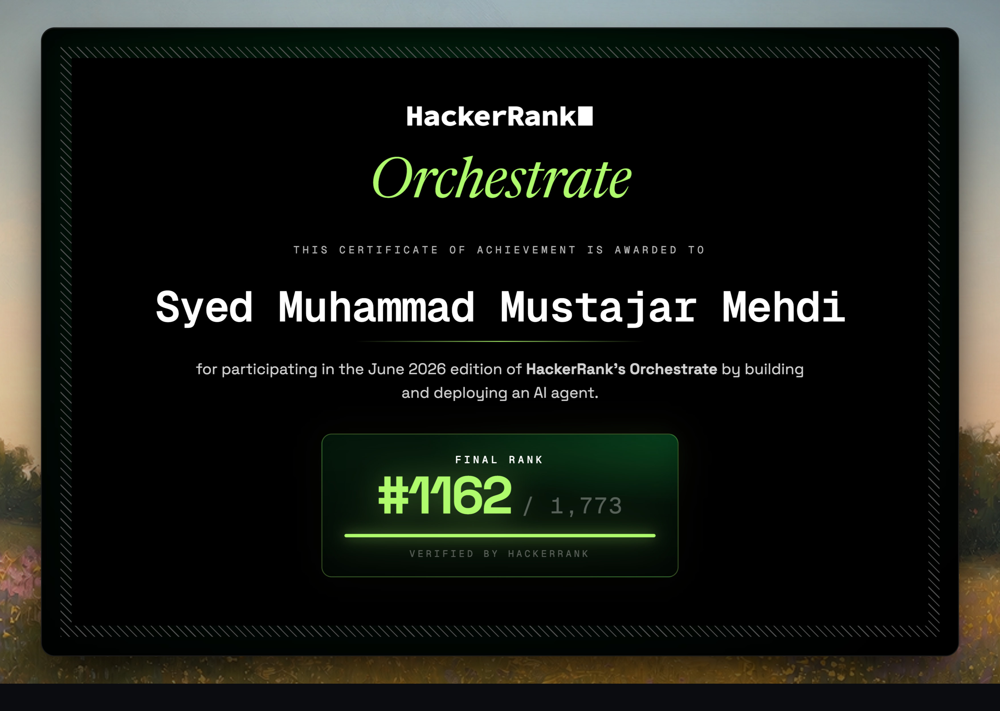

# Hi, I'm Mustajar 👋

### CS Student @ GIKI | Building toward a Master's at RWTH Aachen | Future Data Scientist

---

### 🔭 About Me

- 🎓 Data Science undergraduate at **GIKI** (Ghulam Ishaq Khan Institute), currently in my 2nd year
- 🧠 Self-teaching the full data science stack over summer: **Pandas → NumPy → Data Visualization → Machine Learning**
- 🛡️ Built an automated **AI red-teaming pipeline** that tests LLM agents for jailbreaks & prompt injection, with a live severity-rated Streamlit dashboard
- 🕵️ Built a **multi-modal damage claims verification system** (Gemini Vision) for the HackerRank Orchestrate hackathon — includes quota-safe checkpointing and a self-honest evaluation harness
- 🌱 Currently learning: Feature Engineering, Deep Learning fundamentals
- 🎯 Long-term goal: Master's in Data Science at RWTH Aachen → career in data science at a top tech company
- 💬 Ask me about: Pandas, NumPy, data cleaning, or AI agent evaluation

---

### 🛠️ Tech Stack

  

---

### 📌 Featured Projects

**[🛡️ AI Red-Team Evaluator](https://github.com/Mustajar-Mehdi/ai-red-team-evaluator)**
Multi-agent adversarial testing pipeline that automatically probes LLM agents for jailbreaks and prompt injection, with a severity-rated dashboard.

**[🔍 Multi-Modal Damage Claim Verifier](https://github.com/Mustajar-Mehdi/multimodal-damage-claim-verifier)**
Gemini Vision–powered pipeline that verifies insurance damage claims from images, chat transcripts, and user history — with prompt-injection defense, quota-safe checkpointing, and an honest, auto-generated evaluation report.

**[📊 Data Science Learning Journey](https://github.com/Mustajar-Mehdi/data-science-learning)**
Documented progression through Pandas, NumPy, and Data Visualization — each notebook explains *why* a technique was used, not just *that* it was used.

---

### 📊 GitHub Stats

  

---

### 📄 Certifications

<table>
<tr>
<td width="50%">

**Kaggle · 5-Day AI Agents: Intensive Vibe Coding Course**
*(Kaggle × Google)*

</td>
<td width="50%">

**Kaggle · Pandas**

</td>
</tr>
<tr>
<td width="50%">

**Kaggle · Data Cleaning**

</td>
<td width="50%">

**Kaggle · Data Visualization**

</td>
</tr>
<tr>
<td width="50%">

**Kaggle · Feature Engineering**

</td>
<td width="50%">

**Kaggle · Intro to AI Ethics**

</td>
</tr>
<tr>
<td width="50%">

**Kaggle · Intermediate Machine Learning**

</td>
<td width="50%">

**Kaggle · Intro to Machine Learning**

</td>
</tr>
<tr>
<td width="50%">

**🏆 HackerRank Orchestrate**
*Built & deployed an AI agent — 24-hour hackathon*

</td>
<td width="50%">
</td>
</tr>
</table>

---

### 📫 Connect with me

